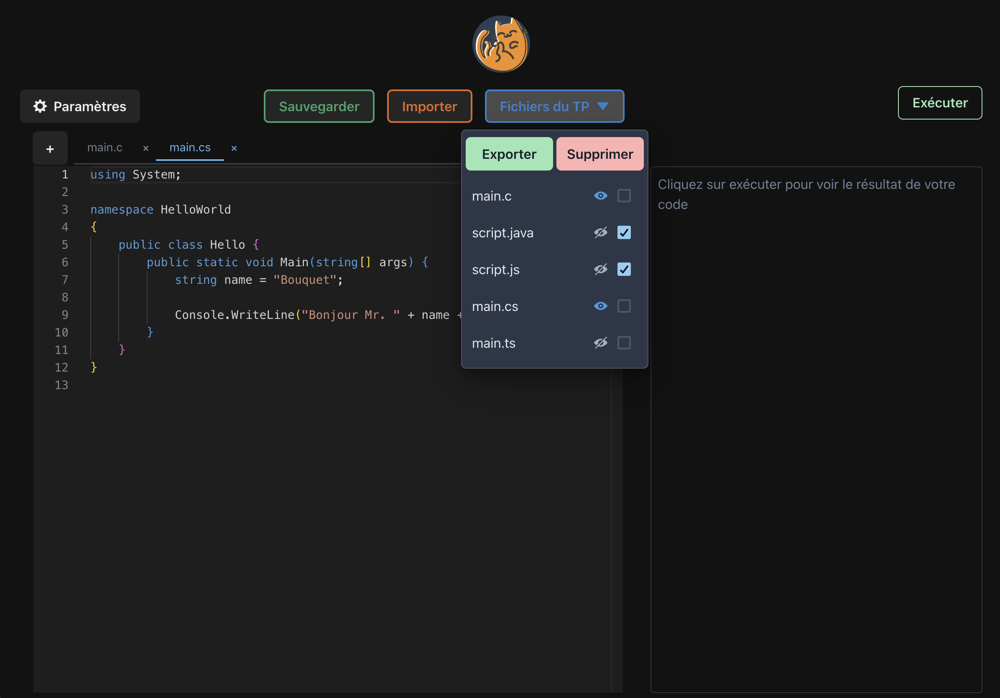

<p align="center">
  <a href="https://www.cat.savoircoder.fr/accueil/" target = "_blank" rel = "noopener noreferrer">
    
  </a>
</p>

<h1 align="center">Code Editor pour CAT</h1>
  
<!--          Sommaire          -->
<br/>
<details>
  <summary>Sommaire</summary>
  <ol>
    <li>
      <a href="#a-propos-du-projet">A propos du projet</a>
      <ul>
        <li><a href="#créé-avec">Créé avec</a></li>
      </ul>
    </li>
    <li>
      <a href="#pour-commencer">Pour commencer</a>
      <ul>
        <li><a href="#prérequis">Prérequis</a></li>
        <li><a href="#installation">Installation</a></li>
      </ul>
    </li>
    <li><a href="#utilisation">Utilisation</a></li>
    <li><a href="#feuille-de-route">Feuille de route</a></li>
    <li><a href="#contact">Contact</a></li>
  </ol>
</details>

<!------------------------------------------------------------------------------------------------------------------------------------------>
## A propos du projet
<!------------------------------------------------------------------------------------------------------------------------------------------>
<br/>

<p align = "center" >
  <a href = "http://localhost:5173/" target ="_blank" rel ="noopener noreferrer">
    
  </a>
</p>

L'objectif de ce projet est de proposer une solution contenant un IDE multi-fenêtre, proposant une coloration et affichage d'erreur syntaxique compatible avec plusieurs langages pouvant être intégré à <a href="https://www.cat.savoircoder.fr/accueil/" target ="_blank" rel ="noopener noreferrer"> CAT</a>.

Celui-ci sera finalement relié à un terminal réalisé par <a href="https://github.com/PiravineJEYAMOHAN" target = "_blank" rel = "noopener noreferrer">Piravine JEYAMOHAN</a>, ce qui permettra de pouvoir exécuter le code et de réaliser des commandes sur les fichiers qui seront stockés sur un Docker sous un dossier spécifique à chaque étudiant.
<br/><br/>

[](https://github.com/PiravineJEYAMOHAN/composant-terminal-cat)

Ceci a pour but de :
- simplifier le travail des étudiants sur CAT en leur permettant de compiler et exécuter leurs projets directement sur le site (évite les allés-retour entre IDE et CAT)
- inciter les étudiants à utiliser le terminal, de moins en moins utilisé étant donné le grand nombre d'interfaces créées masquant son usage
- permettre aux enseignants un suivi du code des étudiants

<!------------------------------------------------------------------------------------------------------------------------------------------>
### Créé avec 
<!------------------------------------------------------------------------------------------------------------------------------------------>
<br/>

[![JavaScript version][JavaScript-badge]][JavaScript-url]

[![React version][React-badge]][React-url]

[![Vite version][Vite-badge]][Vite-url]

[![ChakraUI version][Chakra-badge]][Chakra-url]

[![Monaco Editor version][MonacoEditor-badge]][MonacoEditor-url]

[![Docker version][Docker-badge]][Docker-url]

[![Axios version][Axios-badge]][Axios-url]

[![Piston version][Piston-badge]][Piston-url]


<!------------------------------------------------------------------------------------------------------------------------------------------>
## Pour commencer
<!------------------------------------------------------------------------------------------------------------------------------------------>
> Vous trouverez ci-dessous les différentes étapes nécessaires au lancement du projet

<!------------------------------------------------------------------------------------------------------------------------------------------>
### Prérequis
<!------------------------------------------------------------------------------------------------------------------------------------------>
<br/>

Il faut préalablement installer <a href = "https://nodejs.org/en/download" target = "_blank" rel = "noopener noreferrer">Node.js</a> pour pouvoir lancer le projet.

<!------------------------------------------------------------------------------------------------------------------------------------------>
### Installation
<!------------------------------------------------------------------------------------------------------------------------------------------>
<br/>

Une fois le projet importé, il suffit de se placer dans celui-ci avec un terminal et d'exécuter les commandes suivantes :

```sh
npm install
```
```sh
npm update
```

Puis pour lancer le serveur :

```sh
npm run dev 
```

Il ne reste qu'à mettre l'URL donné dans votre navigateur afin d'accéder au site.

<!------------------------------------------------------------------------------------------------------------------------------------------>
## Utilisation
<!------------------------------------------------------------------------------------------------------------------------------------------>
> Partie incomplète
<br/>

<br/>

<!------------------------------------------------------------------------------------------------------------------------------------------>
## Feuille de route
<!------------------------------------------------------------------------------------------------------------------------------------------>
<br/>

- [x] Ajout du bloc d'éditeur de code à la page
- [x] Menu ouvrant avec des paramètres de l'editeur de code (thème, taille de la police, etc... )
- [x] Raccourcis claviers
- [x] Onglets pour avoir plusieurs fichiers
  - [x] Pop-up création de fichier avec choix du langage et du nom du fichier
  - [x] Extension (ex : .c, .py) automatique selon langage du fichier
  - [x] Detection du langage selon le titre du fichier
  - [x] Possibilité de fermer un onglet
  - [x] Possibilité de renommer les fichiers
  - [x] Menu déroulant listant les fichiers pour les affichers en onglet ou non
  - [x] Supprimer les fichiers depuis le menu déroulant
- [x] Fonction d'indentation avec un bouton
- [x] Importation d'un ou plusieurs fichier(s) au tp
- [ ] Affichage (souligner) des erreurs syntaxiques ( ';' manquant, etc... )
- [ ] Bouton sauvegarder permettant d'enregistrer le/les fichiers :
  - [ ] En local sur machine dans un dossier premièrement
  - [ ] Sur Docker dans un dossier propre à l'étudiant, exemple : *\[numEtudiant] / AlgoProg / TP2 / \[fichier]*

<br/>

<!------------------------------------------------------------------------------------------------------------------------------------------>
## Contact
<!------------------------------------------------------------------------------------------------------------------------------------------>
<br/>

Kevin Soares - ksoares@outlook.fr

Projet : [https://github.com/KVNS7/Code-editor-cat/tree/main](https://github.com/KVNS7/Code-editor-cat/tree/main)

<br/>


<!--              --Variables--              -->

[JavaScript-badge]: https://img.shields.io/badge/JavaScript-%23F7DF1E?style=for-the-badge&logo=javascript&labelColor=grey
[JavaScript-url]: https://developer.mozilla.org/fr/docs/Web/JavaScript

[React-badge]: https://img.shields.io/badge/React%20v18.3.1-%2361DAFB?style=for-the-badge&logo=react&labelColor=grey
[React-url]: https://fr.legacy.reactjs.org/

[Vite-badge]: https://img.shields.io/badge/Vite%20v1.6.8-%23646CFF?style=for-the-badge&logo=vite&labelColor=grey
[Vite-url]: https://vitejs.fr/

[Chakra-badge]: https://img.shields.io/badge/Chakra%20v2.8.2-%23319795?style=for-the-badge&logo=chakraui&labelColor=grey
[Chakra-url]: https://v2.chakra-ui.com/docs/components

[MonacoEditor-badge]: https://img.shields.io/badge/Monaco%20Editor%20v0.48.0-%23007ACC?style=for-the-badge&logo=visualstudiocode&logoColor=%23007ACC&labelColor=grey
[MonacoEditor-url]: https://microsoft.github.io/monaco-editor/docs.html

[Docker-badge]: https://img.shields.io/badge/Docker%20v25.0.3-%232496ED?style=for-the-badge&logo=docker&labelColor=grey
[Docker-url]: https://www.docker.com/

[Axios-badge]: https://img.shields.io/badge/Axios%20v1.6.8-%235A29E4?style=for-the-badge&logo=axios&logoColor=%235A29E4&labelColor=grey
[Axios-url]: https://axios-http.com/fr/docs/intro

[Piston-badge]: https://img.shields.io/badge/Piston-rgb(67%2C126%2C180)?style=for-the-badge&labelColor=black
[Piston-url]: https://piston.readthedocs.io/en/latest/
